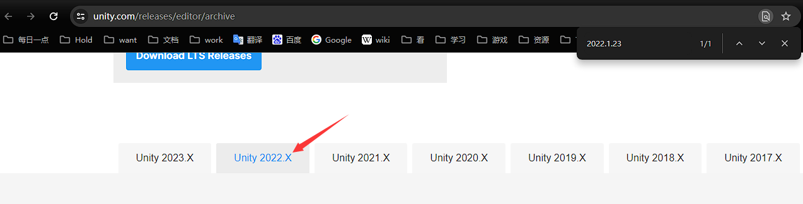

# 禁忌试炼外观MOD制作教程  

- [禁忌试炼外观MOD制作教程](#禁忌试炼外观mod制作教程)
	- [环境准备](#环境准备)
		- [Unity](#unity)
			- [1. UnityHub安装](#1-unityhub安装)
			- [2. 安装Unity 2022.1.23f1](#2-安装unity-2022123f1)
		- [Blender](#blender)
	- [武器MOD制作](#武器mod制作)
		- [1. 在工具目录创建MOD目录](#1-在工具目录创建mod目录)
		- [2. 创建Blender项目保存到MOD目录](#2-创建blender项目保存到mod目录)
		- [3. 导入 武器MOD样例模型](#3-导入-武器mod样例模型)
		- [4. 导入 外部模型](#4-导入-外部模型)
		- [5. 将所有外部模型合并到只剩下一个](#5-将所有外部模型合并到只剩下一个)
		- [5. 调整外部模型大小与位置，对齐 武器MOD样例模型](#5-调整外部模型大小与位置对齐-武器mod样例模型)
		- [6. 合并模型，合并贴图，调整UV](#6-合并模型合并贴图调整uv)
		- [7. 删除武器MOD样例模型](#7-删除武器mod样例模型)
		- [8. 保存Blender项目](#8-保存blender项目)
		- [9. Unity配置Blender对象属性](#9-unity配置blender对象属性)
		- [10. 创建对象对应 Prefab Variant](#10-创建对象对应-prefab-variant)
		- [11. 复制 武器MOD样例材质 到MOD目录](#11-复制-武器mod样例材质-到mod目录)
		- [12. MOD材质配置修改](#12-mod材质配置修改)
		- [13. Prefab Variant 配置组件](#13-prefab-variant-配置组件)
		- [14. 创建武器MOD文件](#14-创建武器mod文件)
		- [15. 进游戏进行测试](#15-进游戏进行测试)
	- [MOD发布上传](#mod发布上传)
	- [其它信息](#其它信息)

## 环境准备

### Unity

#### 1. UnityHub安装  

Unity官网：https://unity.com/cn

去Unity官网下载安装即可，与普通的软件安装流程无异  

#### 2. 安装Unity 2022.1.23f1  

Unity版本归档：https://unity.com/releases/editor/archive  

  

  

找到指定版本的Unity，选择用 UnityHub 安装即可  

### Blender  

Blender3.6官网下载： https://www.blender.org/download/lts/3-6/

当前推荐安装 3.6 版本，用着比较舒适  

也可以用 Steam 下载，在对应的属性中指定版本即可  

  

## 武器MOD制作

### 1. 在工具目录创建MOD目录  

  

在 `TheTabooTrial/# ModBuilder/Assets/` 目录创建自己的MOD目录  

实际上就是直接来到对应目录创建一个文件夹，很简单   

### 2. 创建Blender项目保存到MOD目录  

  

1. 创建blender项目  
2. 项目另存为到MOD目录，项目名取一个英文名  

### 3. 导入 武器MOD样例模型  

  

武器MOD样例模型路径: `TheTabooTrial/# ModBuilder-v1.0.2/Assets/# Sample Weapon/sample_weapon.FBX`    

### 4. 导入 外部模型

### 5. 将所有外部模型合并到只剩下一个  

武器MOD只能展示一个对象，所以要将导入的外部模型合并到只有一个为止  

对应的内容合并，需要处理对应UV，贴图内容  

### 5. 调整外部模型大小与位置，对齐 武器MOD样例模型  

      

简单调整武器模型既是，需要注意一下剑柄的大小与位置，避免到时候看着奇怪  

如果武器为单刃武器，可能会有方向问题（用刀背打人也太怪了），若发现方向不对，就手工反转模型  

### 6. 合并模型，合并贴图，调整UV  

由于武器MOD只允许有一个模型，而一个模型只能引用一个材质，所以需要将模型合并到只剩下一个，对应的UV需要调整，对应的贴图也需要合并  

### 7. 删除武器MOD样例模型  

为了最终MOD不显示MOD样例的模型，这里需要删除  

### 8. 保存Blender项目  

保存项目后，Unity对应的MOD目录会根据blender数据生成对象，名字与blender文件名一致  

启动 Unity工具项目  

路径：`TheTabooTrial/# ModBuilder-v1.0.1/Assets/Preview Magica Cloth.unity`  

    

### 9. Unity配置Blender对象属性  

1. 取消 ImportDeformPercent    

       

2. AnimationType 设置为 Generic  

     

3. 取消选择 ImportAnimation  

     

4. MaterialCreationMode 设置为 None

     

### 10. 创建对象对应 Prefab Variant  

  

### 11. 复制 武器MOD样例材质 到MOD目录  

其中的材质应该是游戏里用的二次元材质，直接从样例中复制过来可以少配置一些东西  

  

实际上，也可以使用Unity自己的材质，那样最终的效果会更加有质感一些  

### 12. MOD材质配置修改   

1. 材质改名

   

   改个名字好识别，以免混淆

2. 将自己MOD的贴图复制到MOD目录     

   直接复制贴图到文件夹下即可

3. 材质球中修改材质引用的贴图  

     

   将对应贴图拖动到材质配置中即可

样例中相当于只配置了基础的颜色，实际上如果想要模型渲染效果好，需要配置非常多的内容。

制作精良的模型一般会有较多的贴图控制材质表现，比如说金属度，发光，透明等。这些内容都需要在这一步配置完成  

### 13. Prefab Variant 配置组件  

1. 复制 武器样例MOD的 WaponVariant 到 MOD目录备用    

        

   复制内容过来只是为了方便复制内容，在复制完内容后，就可以将之删除了  

2. 从 样例MOD的 WaponVriant 复制组件内容到 自己MOD的 WaponVariant 中  

     

   逐个复制对应组件到自己的MOD对象之中  

3. 配置组件对应属性  

   

   1. 配置 Mesh 为自己的模型
   2. 配置 Materials 为自己的材质

### 14. 创建武器MOD文件  

1. 创建MOD文件  

     

   用 Prefab Variant 生成MOD文件，四个选项对应着四种武器  

   这里全部都创建一个  

2. 找到被创建的MOD文件  

   被创建的MOD文件存放在 `TheTabooTrial/# ModBuilder-v1.0.2/Assets` 目录下

   

3. 在游戏对应的创意工坊目录创建文件夹

   此游戏的Steam的创意工坊目录：`SteamLibrary/steamapps/workshop/content/2455060`  

   这个目录会根据steam目录不同而有所不同，但后续的路径都是一样的   

     

​		在文件夹下创建一个纯数字命名的文件夹，将生成的MOD文件放进进去  

### 15. 进游戏进行测试  

​	

## MOD发布上传

！！！注意，所有路径都不要存在中文内容  ！！！  

1. 进入到一个目录作为MOD存档目录  

   最好不要在 MOD工具目录下，以免每次修改unity都要加载  

2. 确认 `SteamCMD` 路径   

   理论上工具中已经准备好了此内容，需要人工找到它并记录下路径  

   路径样例： `D:\SteamLibrary\steamapps\common\TheTabooTrial\# Steamworks-SDK-158a\sdk\tools\ContentBuilder\builder\steamcmd.exe`  

   由于Steam目录有所不同，`steamcmd.exe` 路径也会有所不同  

   若是找寻不到，也可以在网上下载  

3. 创建 `steamcmd` 登录脚本  

     

   1. 创建一个记事本  

   2. 写入命令  

      命令格式为: `"Steamcmd.exe路径" +login Steam账号名`  

      命令样例: `"D:\SteamLibrary\steamapps\common\TheTabooTrial\# Steamworks-SDK-158a\sdk\tools\ContentBuilder\builder\steamcmd.exe" +login RecluseXU`

   3. 保存文件  

   4. 修改文件名与后缀  

      文件名

      修改样例: `steamcmd_login.bat`

   5. 以管理员身份运行登录脚本    

        

      运行后会出现一个命令行，第一次登录可能需要输入密码与认证  

4. 创建一个MOD存档目录  

   实际上就是创建一个文件夹  

     

   例如：`Honkaiimpact3rdRedCherryBlossom`  

5. 进入MOD存档目录，创建MOD文件目录，放入MOD文件  

     

     

6. MOD存档目录创建 创意工坊配置文件 `.vfd`  

   1. 新建记事本  

   2. 记事本中写入配置内容  

      ~~~
      "记录名"
      {
      	"appid"		"2455060"
      	"publishedfileid"		""
      	"contentfolder"		"MOD文件夹目录"
      	"previewfile"		"MOD预览图片路径"
      	"visibility"		"0"
      	"title"		"MOD名称"
      	"description"		"MOD描述"
      	"changenote"		"文件的修改信息"
      }
      
      ~~~

      样例：

      ~~~
      "战双帕弥什_露西亚深红之渊_红樱"
      {
      	"appid"		"2455060"
      	"publishedfileid"		""
      	"contentfolder"		"D:\\SteamLibrary\\steamapps\\common\\TheTabooTrial\\mods\\Honkaiimpact3rdRedCherryBlossom\\mod"
      	"previewfile"		"D:\\SteamLibrary\\steamapps\\common\\TheTabooTrial\\mods\\Honkaiimpact3rdRedCherryBlossom\\image.png"
      	"visibility"		"0"
      	"title"		"MOD武器-战双帕弥什_露西亚深红之渊_红樱"
      	"description"		"MOD制作：EvilRecluse 模型来源：https://www.aplaybox.com/details/model/CygNgmqE6Ey1"
      	"changenote"		"Version 1.0"
      }
      ~~~

   3. 修改文件名与后缀  

      文件名后缀修改为 `.vdf`  

      样例: `workshop_config.vdf`  

7. MOD存档目录 创建记事本，记录信息    

   1. 记录MOD上传更新命令    

      命令: `workshop_build_item ".vdf文件路径"`  

      样例：

      ~~~
      workshop_build_item "D:\SteamLibrary\steamapps\common\TheTabooTrial\mods\TowerofFantasyLiberia\create_mod.vdf"
      ~~~

   2. 记录MOD描述  

        

8. `steamcmd` 登录后 执行 MOD上传更新命令  

       

   这一步需要科学上网  

9. 查看上传的MOD  

       

       

     

   剩下的内容都是可以用界面上的内容编辑的了  

## 其它信息  

文档作者: EvilRecluse      https://space.bilibili.com/4282123

禁忌试炼MOD制作官方文档: https://steamcommunity.com/sharedfiles/filedetails/?id=3117650300&snr=2_9_100000_
